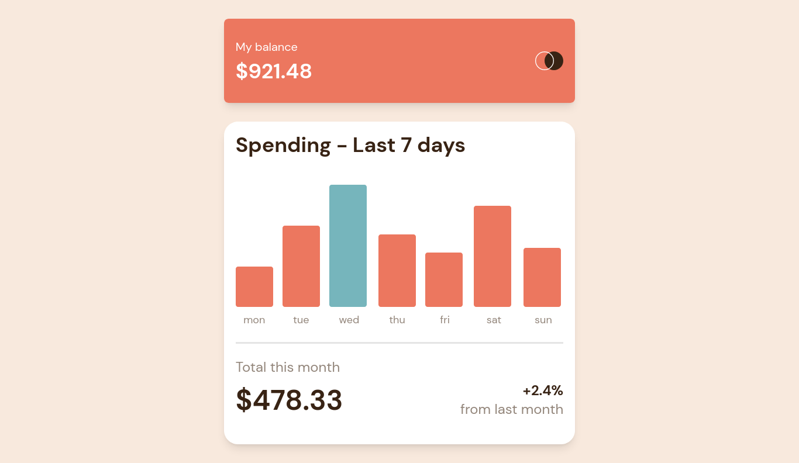

# Frontend Mentor - Expenses chart component solution

This is a solution to the [Expenses chart component challenge on Frontend Mentor](https://www.frontendmentor.io/challenges/expenses-chart-component-e7yJBUdjwt). Frontend Mentor challenges help you improve your coding skills by building realistic projects. 

## Table of contents

- [Overview](#overview)
  - [The challenge](#the-challenge)
  - [Screenshot](#screenshot)
  - [Links](#links)
- [My process](#my-process)
  - [Built with](#built-with)
  - [What I learned](#what-i-learned)
  - [Continued development](#continued-development)
- [Author](#author)

## Overview

### The challenge

Users should be able to:

- View the bar chart and hover over the individual bars to see the correct amounts for each day
- See the current day’s bar highlighted in a different colour to the other bars
- View the optimal layout for the content depending on their device’s screen size
- See hover states for all interactive elements on the page
- **Bonus**: Use the JSON data file provided to dynamically size the bars on the chart

### Screenshot

### Links

- Solution URL: https://github.com/bad1987/expenses_chart_component.git
- Live Site URL: https://bad1987.github.io/expenses_chart_component

## My process

### Built with

- CSS custom properties
- [React](https://reactjs.org/) - JS library
- [Tailwindcss](https://tailwindcss.com/) - Utility-first CSS framework

### What I learned

I've never use tailwindcss before. That is why I chose it for this project. I found it really great for responsive design
I learnt the basics and I would like to get better at it. 

### Continued development

Responsive design

## Author

- Frontend Mentor - [@bad1987](https://www.frontendmentor.io/profile/bad1987)
- Twitter - [@DidierBayanga](https://www.twitter.com/DidierBayanga)